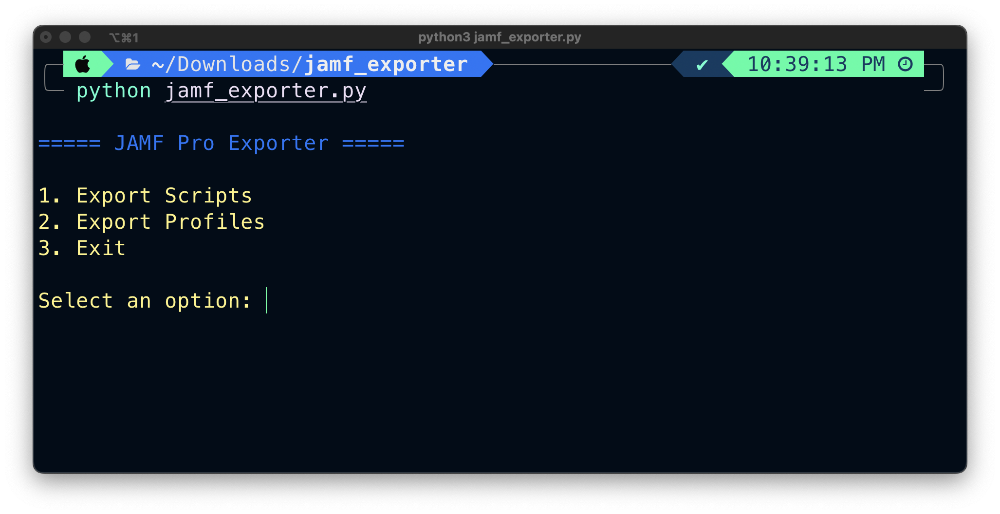

# Jamf Exporter
Export all scripts, proflles and more from Jamf Pro

This script allows you to export all the macOS scripts and configuration profiles from a JAMF Pro server. Scripts are saved with their file extensions and profiles as .mobileconfig files on your local system.

#
### Requirements
- `pip install -r requirements.txt`
- unopass: https://github.com/amadotejada/unopass

#
### Usage
1. Configure unopass
2. Fork or download this project
3. Run it from the command line:

`python jamf_profiles_exporter.py`

- Scripts are downloaded in: `./exported_jamf_scripts`
- Profiles are downloaded in: `./exported_jamf_profiles`

#
### TODO
- Add support for exporting printers
- Add support for exporting iOS configuration profiles

#
### Licence
*Jamf Exporter* is released under the [MIT License](https://github.com/amadotejada/jamf-exporter/blob/main/LICENSE)

#